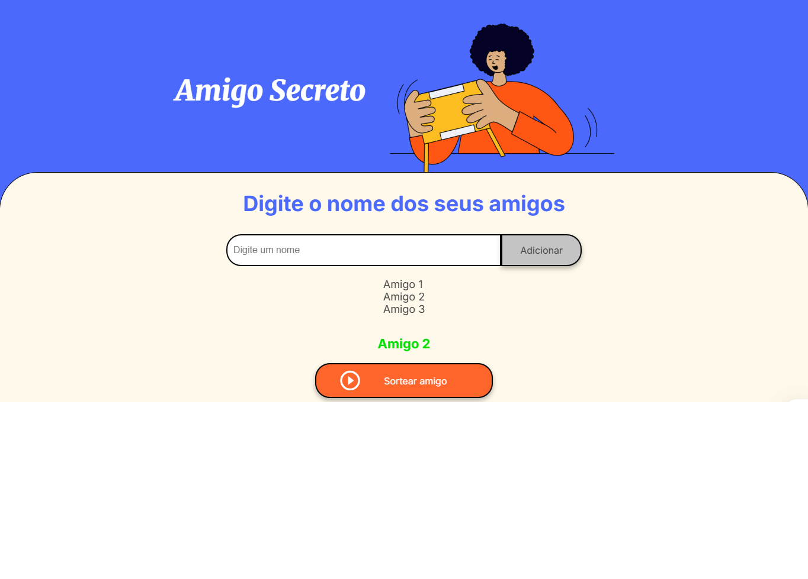

# challenge-amigo-secreto
Amigo Secreto - App de Sorteio
Um aplicativo web simples para gerenciar e sortear amigos secretos. Desenvolvido com HTML, CSS e JavaScript.

Exemplo do App:

Link do App no Github: https://andreegidio.github.io/challenge-amigo-secreto/

Funcionalidades:

- Adicionar Participantes: Cadastre os nomes dos amigos que participarão do sorteio.
- Visualização em Lista: Todos os participantes adicionados são exibidos em uma lista na página.
- Sorteio Aleatório: Escolha aleatoriamente um amigo entre os participantes cadastrados.
- Destaque Visual: O amigo sorteado é destacado visualmente para fácil identificação.

Como Usar:

- Abra o arquivo index.html em qualquer navegador moderno.
- Digite o nome de um participante no campo de texto.
- Clique no botão "Adicionar" para incluir o participante na lista.
- Repita os passos 2 e 3 para adicionar todos os participantes.
- Quando todos os participantes estiverem na lista, clique no botão "Sortear Amigo".
- O sistema irá escolher um amigo aleatoriamente e destacá-lo na página.

Estrutura do Projeto:
 challenge-amigo-secreto/
├── index.html          # Estrutura principal da página
├── assets/
│   └──                 # Arquivos das imagens
├── styles.css          # Estilos da aplicação
├── app.js              # Lógica de funcionamento
└── README.md           # Este arquivo

Tecnologias Utilizadas:

HTML5: Estrutura da página
CSS3: Estilização e animações
JavaScript: Lógica de adição de amigos e sorteio aleatório

Implementação Técnica
---------------------
HTML
----
A estrutura principal inclui:
- Formulário para adicionar participantes
- Lista para exibir os amigos adicionados
- Botão para realizar o sorteio
- Seção para exibir o resultado em destaque

CSS
---
Estilos implementados para:
- Layout responsivo
- Animações para adição de participantes
- Estilo de destaque para o amigo sorteado
- Design visual atraente e intuitivo

JavaScript
----------
Funcionalidades implementadas:
- Adição de participantes à lista
- Validação de entrada (nomes em branco ou menores que 3 caracteres)
- Algoritmo de sorteio aleatório
- Manipulação para atualizar a interface
- Destaque visual do amigo sorteado

